# Handmade Ray Tracer
A CPU ray-tracer(or path tracer), which tries to be as fast as possible using SIMD (Single Instruction Multiple Data) and multi-threading.
Renders 3D models and uses a BVH (bounding volume hierarchy) to accelerate this.
BRDFs (Bidirectional Reflectance Distribution Function) are used for reflections, which are based on measurements of real materials.

[MERL BRDF source](https://www.merl.com/research/downloads/BRDF/)

## Screenshots
(anti-chronological order)

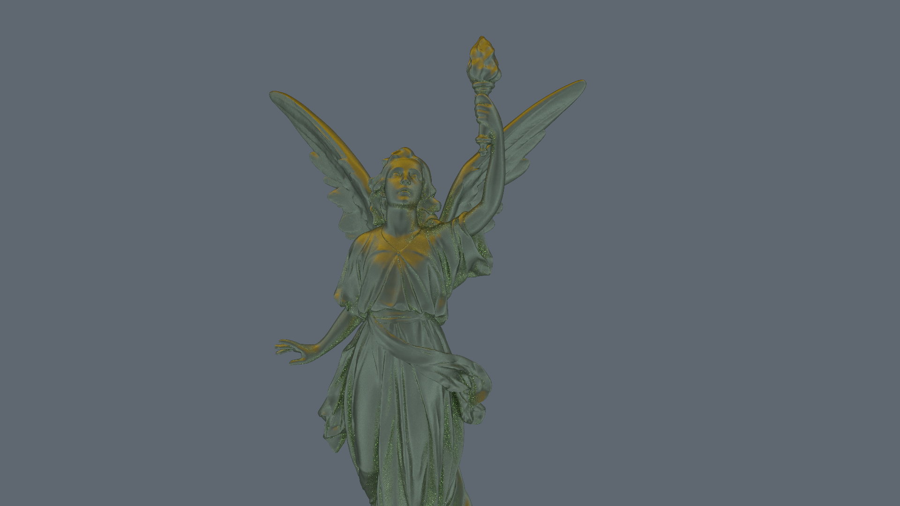
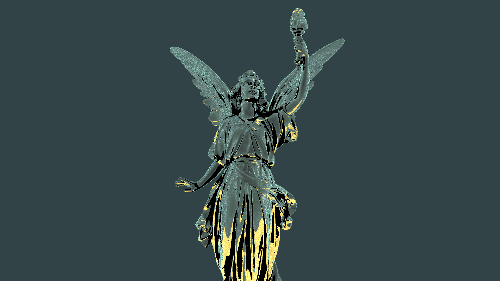
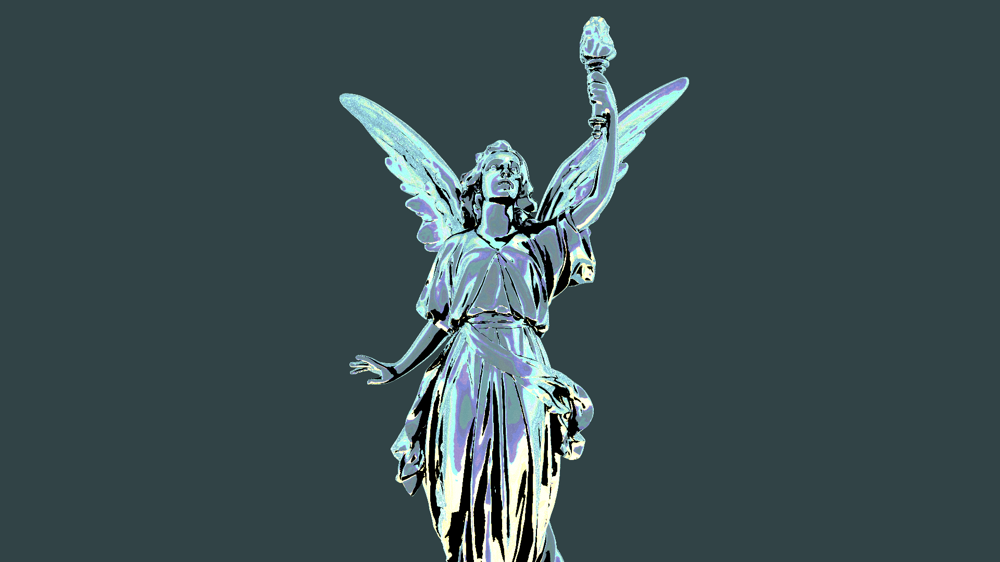
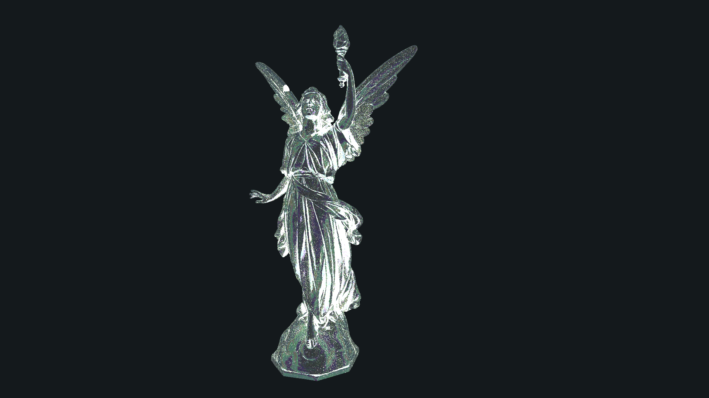
~300k triangles in one model.
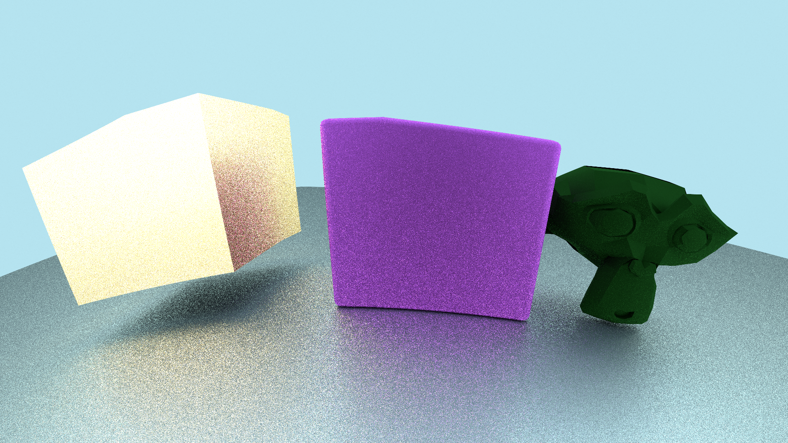
The camera is inside a glass like sphere.
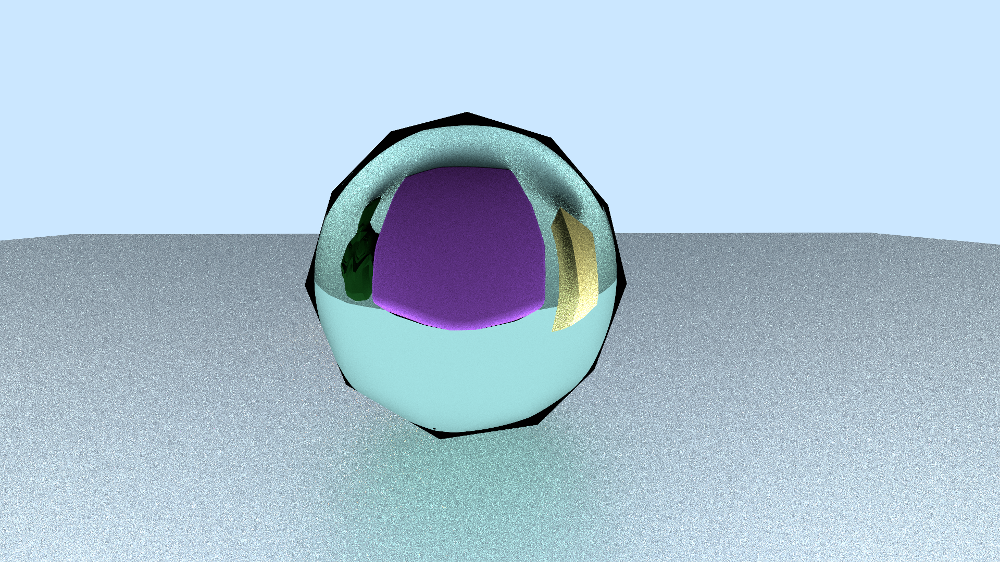
Refractions.

Non-uniform scaled models.
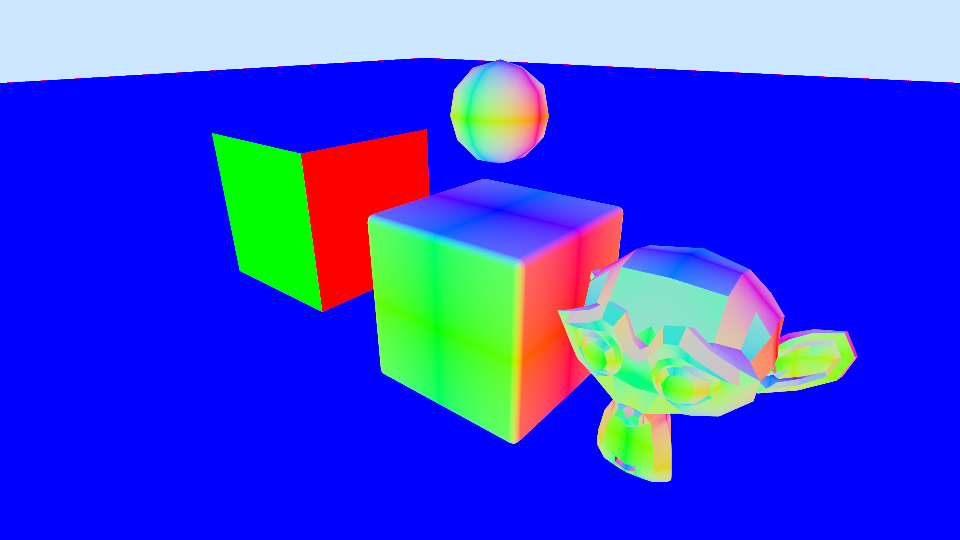
Fixed buggy normals and uv interpolation.

Load obj-files with per vertex normals.

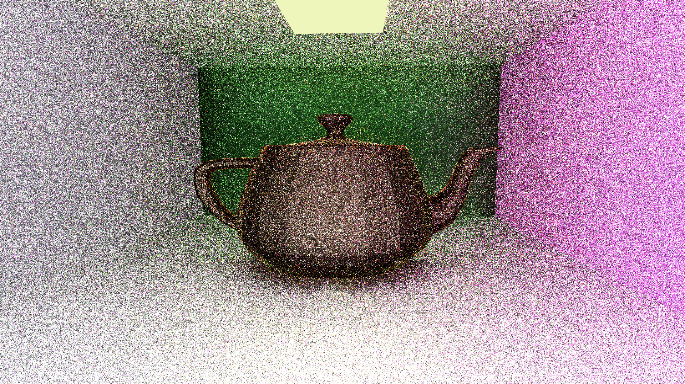

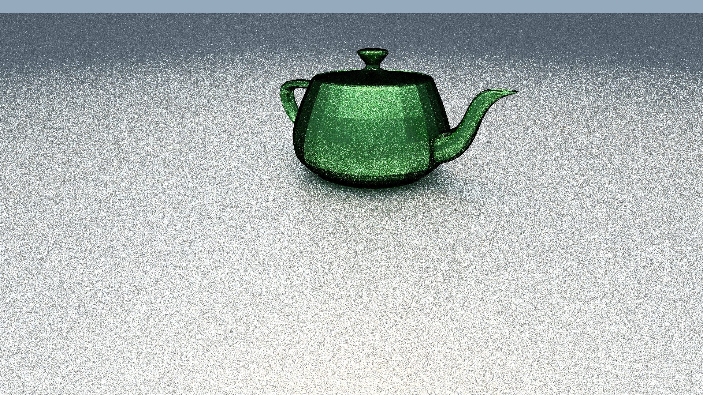
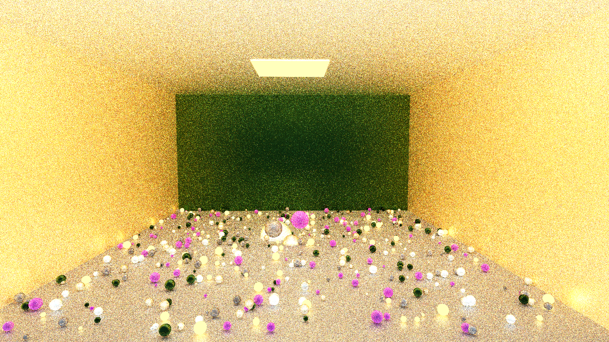

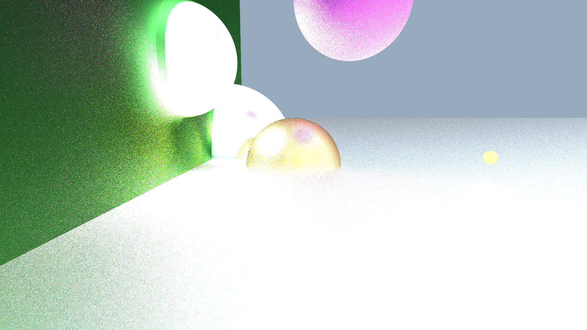
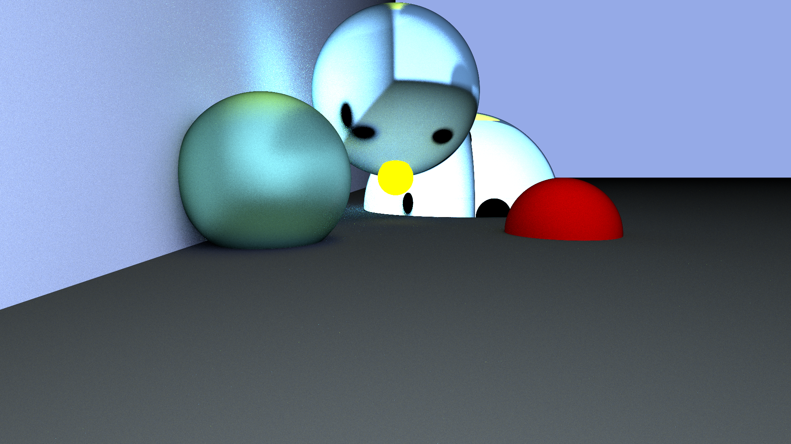

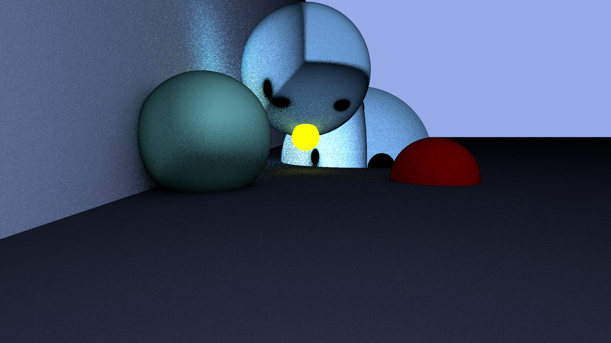