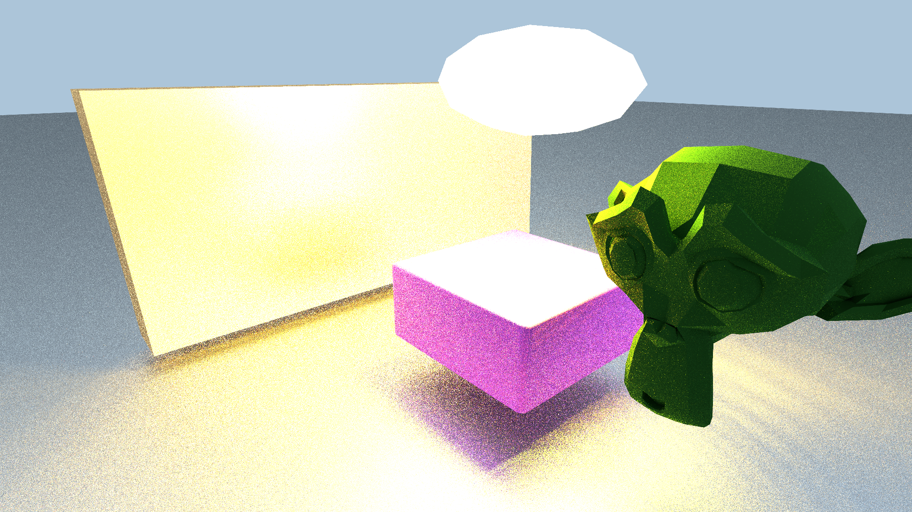
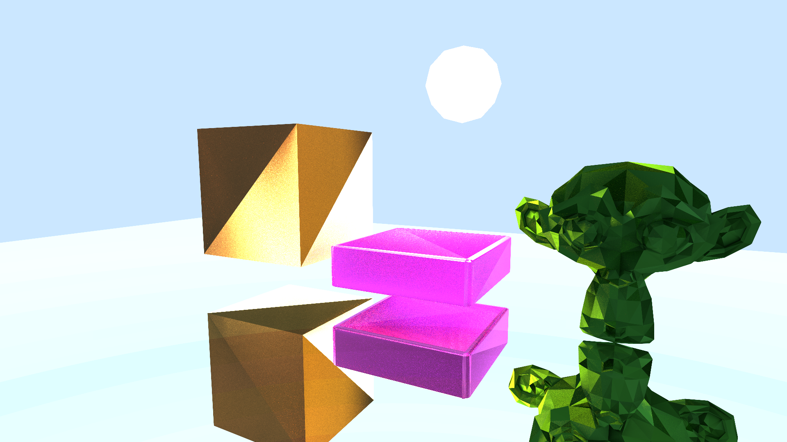
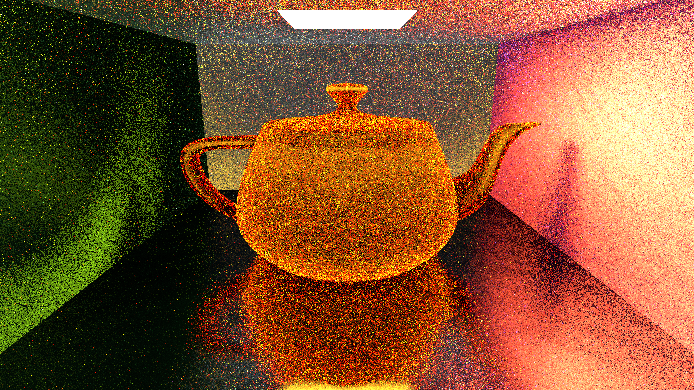
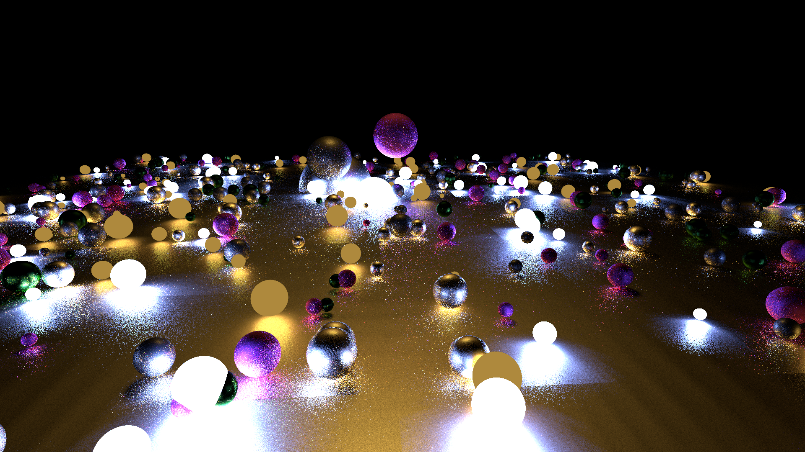
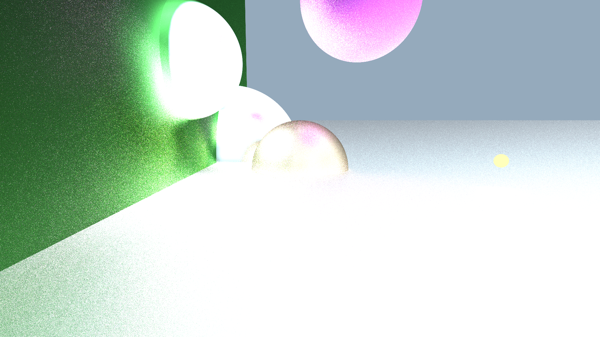
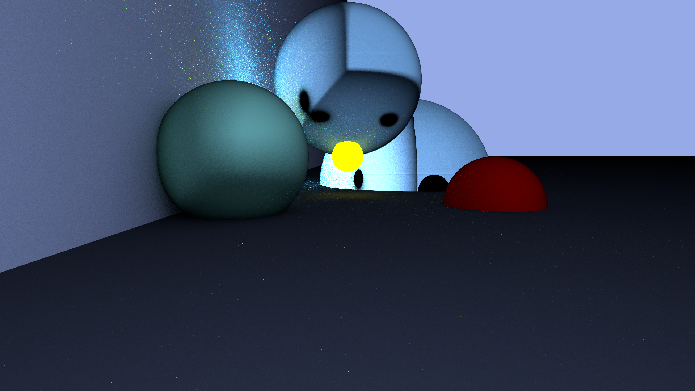
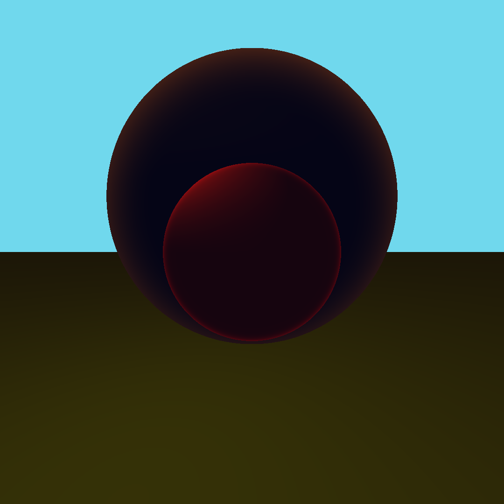
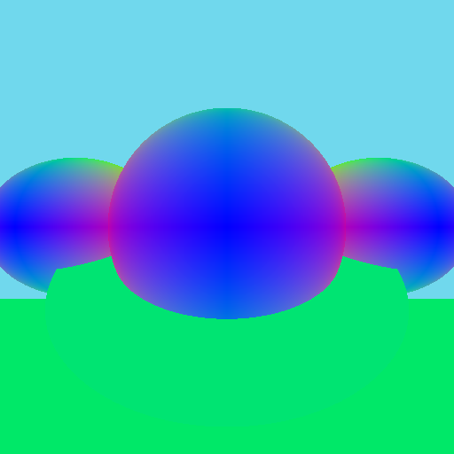
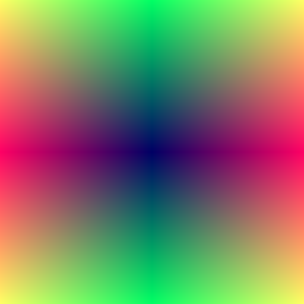
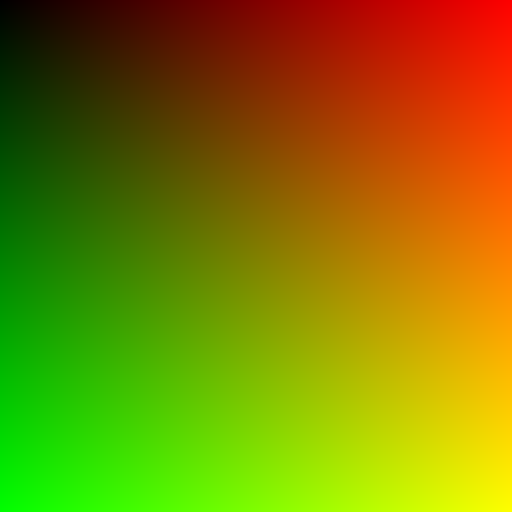

# Ray Tracing
3 cpu ray tracers. The first in java was part of a voluntary uni project. The other two were made in my free time.

## Screenshots
(anti-chronological order)

### Handmade

### Java
 
 
 
 

 
 

 

 

 
 
 

 
 
 
 

 
 
 
 

 
 
